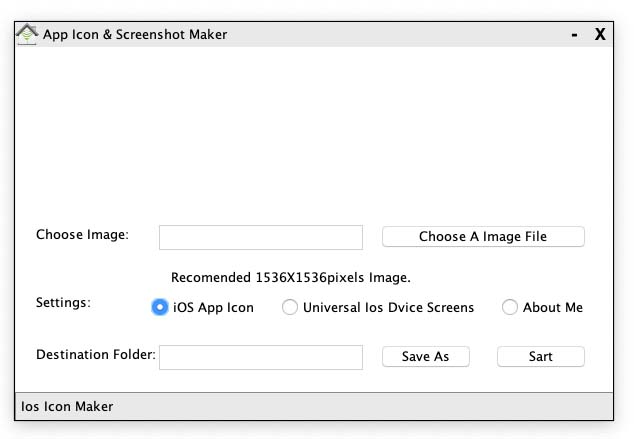

  

  

Cross platform Java Swing application with custom title bar, close & minimize buttons, window icon and status bar concept.

## Features

- macOS 
- Linux
- Windows

## Requirements

- JDK 7.1+

## Compile

` javac AppIconMaker.java`

## Run

`java AppIconMaker`

